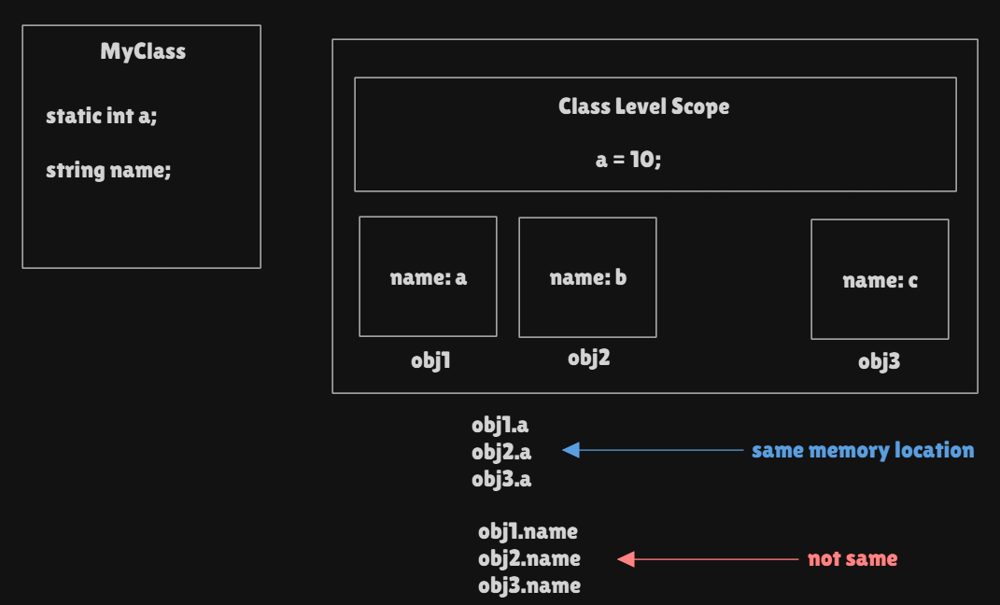

### [CodeFlow1.java](CodeFlow1.java)
- Static block runs first
- Main method runs
- Then instance-initializers runs
- Then the constructor
- Then the remaining other stuff

```
OUTPUT
B
E
A
C
D
F
```
### [CodeFlow2Driver](CodeFlow2Driver.java) & [CodeFlow2Test](CodeFlow2Test.java)
- Driver method static block runs first
- Then main method
- Then the second class's static blocks
- Then the instance provider static method
- Then instance-initializer blocks 
- Then the constructor
- Then the remaining other stuff

NOTE 

[1] Second class's static method did not run until the class is involved, 
only when we invoke `CodeFlow2Test.getInstance()` the second class is initialized. Which means, 
java is both interpreted & compiled language! It is compiled in line level and interpreted in class level. 

[2] Class is blueprint and instance is the real thing. A class is not anything until an object is created. 

[3] But it doesn't mean that a class that has only static method and variables is like a regular class with single instance,
rather it differs by how java stores info inside memory. All regular class & instances info is stored in the heap memory. 
The class has a special dedicated place where its blueprint is stored, while the instances are stored nearby but not in the class scope.
Static stuffs are special, they are stored in the class scope hence they are accessible by all instance and a change in it is visible to all instances.


```
OUTPUT
K
H
B
C
F
A
D
E
G
I
```

### [CodeFlow3.java](CodeFlow3.java)
- There can be so many curley braces!

```
OUTPUT
A
B
C
D
Brain is not braining...

```
